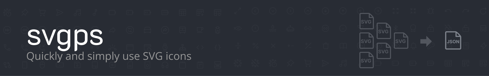

## What is SVGPS?

`SVGPS` converts your icons into a single JSON file that is ready to use in your frontend or mobile projects.

**Note:** Currently in `BETA` and still in development.

## Why do you need it?

Dealing with a large number of icon files, converting them into components or using them directly as SVGs can be frustrating. You can convert your icons into fonts, but unfortunately, it deprives us of the benefits of SVG format. That is why we found a way to store all our icons in a single JSON file and use them as SVGs!

## How does it work?

Just import the icons that you want to use in your project! You can rename your icons, add new ones or remove them as you like. After creating a set of icons, SVGPS parses the data of that set and creates the single file you need. You can use that JSON file directly in your projects with the help of [react-icomoon](https://github.com/aykutkardas/react-icomoon), [vue-icomoon](https://github.com/aykutkardas/vue-icomoon) or [svelte-icomoon](https://github.com/aykutkardas/svelte-icomoon) packages.

## What is Icomoon?

[Icomoon](https://icomoon.io/) is an icon management tool that allows you to convert your icon packs into many different formats. It produces a document for your packs, and `SVGPS` is built as an alternative to smooth the conversion process by allowing you to get a JSON file directly without feeling lost.

### Usage Example

Your `Icon` component and the `JSON` file you created are located in the same directory and combined with the help of `*-icomoon` packages previously mentioned.

```
Icon
|____ Icon.jsx
|____ selection.json
```

```jsx
// Icon.jsx
import IcoMoon from "react-icomoon";
import iconSet from "./selection.json";

const Icon = (props) => <IcoMoon iconSet={iconSet} {...props} />;

export default Icon;
```

See [react-icomoon](https://github.com/aykutkardas/react-icomoon) or [vue-icomoon](https://github.com/aykutkardas/vue-icomoon) for details on how to use the `Icon` component.

---

### Related Links

- [svgps](https://github.com/aykutkardas/svgps)
- [svgps-cli](https://github.com/aykutkardas/svgps-cli)
- [react-icomoon](https://github.com/aykutkardas/react-icomoon)
- [vue-icomoon](https://github.com/aykutkardas/vue-icomoon)
- [svelte-icomoon](https://github.com/aykutkardas/svelte-icomoon) (soon)

---

### Special Thanks

- [gizemnkorkmaz](https://github.com/gizemnkorkmaz) (Development)
- [dgknca](https://github.com/dgknca) (UI Design)
